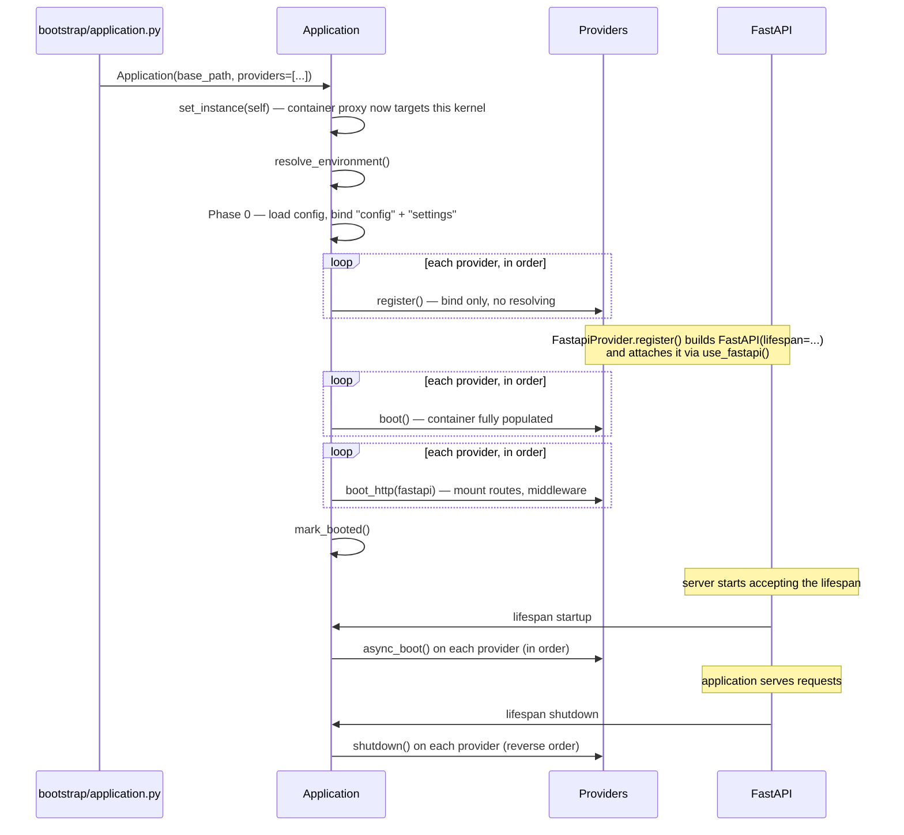

Everything in an Alata application flows through a single object: the `Application` kernel built in `bootstrap/application.py`. Understanding how that kernel constructs itself — and when each lifecycle phase runs — makes the rest of the framework predictable: you always know what is available, and when.

## One kernel, three entry points

An Alata project has exactly one application kernel. HTTP requests, console commands, and queue workers are just different views over it — they all share the same [service container](/docs/architecture/container), the same configuration, and the same [service providers](/docs/architecture/providers).

The kernel is constructed once, in `bootstrap/application.py`:

```python title="bootstrap/application.py"
from pathlib import Path

from app.providers.command_provider import CommandProvider
from app.providers.fastapi_provider import FastapiProvider
from bootstrap.providers import FRAMEWORK_PROVIDERS, PROVIDERS

from alata.application import Application
from alata.providers.database_provider import DatabaseProvider

app = Application(
    base_path=Path(__file__).parent.parent,
    providers=[
        DatabaseProvider,
        CommandProvider,
        *FRAMEWORK_PROVIDERS,
        *PROVIDERS,
        FastapiProvider,
    ],
)
```

Every entry point imports this one module:

```python title="bootstrap/app.py"
"""ASGI entry point — a thin view over the ONE application kernel."""
from bootstrap.application import app as kernel

app = kernel.fastapi
```

```python title="bootstrap/broker.py"
"""Queue worker entry point — same kernel, same container."""
from bootstrap.application import app

broker = app.make("queue.broker")
```

- **HTTP** — `uvicorn bootstrap.app:app` serves `kernel.fastapi`, the FastAPI instance owned by the kernel.
- **Console** — the `./alata` script imports `bootstrap.application` and calls `app.handle_command()`, so every command runs against the fully registered container.
- **Queue workers** — the taskiq worker CLI targets `bootstrap.broker:broker`. Importing that module boots the whole application, so tasks get initialized database engines and every other service with no worker-specific setup.

<Callout type="info">
Because importing `bootstrap.application` runs the full synchronous provider lifecycle as a module-level side effect, a binding registered by any provider is visible to HTTP handlers, CLI commands, and queue tasks alike. There is never a "worker container" that drifted from the "web container".
</Callout>

## Constructing the Application

`Application` accepts four arguments:

```python
from alata.application import Application

app = Application(
    base_path=Path(__file__).parent.parent,  # project root; defaults to the cwd
    env=None,                # environment name; resolved automatically when omitted
    providers=[...],         # your provider classes, in boot order
    config_module="config",  # the Python package your config modules live in
)
```

The constructor is where most of the lifecycle happens — by the time `Application(...)` returns, configuration is loaded and every provider has registered and booted. In order, it:

1. **Promotes itself to the current container.** `Application` is itself a `ServiceContainer` subclass; the constructor calls `ServiceContainer.set_instance(self)` so the module-level `container` proxy now points at this kernel everywhere in the process.
2. **Resolves the environment.** Determines the active environment (from `env` or the process environment) and loads the matching env files from `base_path`.
3. **Loads configuration** (Phase 0).
4. **Registers providers** (Phase 1).
5. **Boots providers** (Phase 2), including the HTTP boot phase when a FastAPI kernel is attached.

Async work — opening connection pools, warming clients — is deliberately deferred to the FastAPI lifespan, covered [below](#startup-and-shutdown-the-fastapi-lifespan).

## Phase 0: configuration loading

Before any provider runs, the kernel loads the app's config package (the `config_module` argument, `"config"` by default) and binds two values into the container:

- `"config"` — a `ConfigRepository` built from your `config/*.py` modules, queried with dot notation: `container.make("config").get("database.connections.default")`.
- `"settings"` — your app's settings object (pydantic settings by convention), from `config/settings.py`.

Both are bound as pre-built *instances*, which matters for the next phase: instance bindings are the only thing providers are allowed to resolve while registering. That is why configuration must load first — every provider can rely on `self.app.make("config")` from the very first line of its `register()` method.

See [Configuration](/docs/getting-started/configuration) for the config file conventions.

## Phase 1: provider registration

The kernel walks your `providers` list in order, instantiates each provider class with the application, and calls its `register()` method. Registration is for *binding only* — providers put factories and singletons into the container but must not resolve other providers' services, because those providers may not have registered yet.

The container enforces this contract: during the registration phase, `container.make()` raises a `RuntimeError` for anything that is not a pre-built instance binding (like `"config"` and `"settings"`).

```python
# Inside register() — this raises:
# RuntimeError: Cannot resolve 'cache' during Phase 1 (register).
#               Move resolution logic to a boot() method.
self.app.make("cache")

# This is fine — "config" is a Phase-0 instance binding:
connections = self.app.make("config").get("redis.connections", {})
```

A providers entry can also be a `(ProviderClass, config)` tuple; the config dict (or a callable returning one) is passed to the provider's constructor and available as `self.config`.

## Phase 2: boot and HTTP boot

Once *every* provider has registered, the kernel loops through them again and calls `boot()` on each. At this point the whole container is populated, so `boot()` is the safe place to resolve services, wire event listeners, and include routers.

Then, if a FastAPI kernel has been attached (the `FastapiProvider` does this via `use_fastapi()` during its own registration), the kernel runs the **HTTP boot** phase: every provider that defines `boot_http(app)` receives the FastAPI instance. This is how framework routes such as `/health` mount without any code in your project — the health provider adds them in its `boot_http()` hook.

Finally the kernel calls `mark_booted()`. Parts of the framework that must stay inert until the app is fully assembled — such as the model event dispatcher — gate on `container.booted`.



## Startup and shutdown: the FastAPI lifespan

Some initialization needs a running event loop — opening async database pools, awaiting a client's setup call. That cannot happen in the constructor, so the framework's `FastapiProvider` (in `alata.http`) wires the remaining phases into the FastAPI lifespan when it builds the app:

```python title="alata/http/provider.py (framework source, abridged)"
@asynccontextmanager
async def lifespan(_fastapi_app):
    await application.async_boot_providers()   # startup
    try:
        yield                                  # ... application serves requests ...
    finally:
        await application.shutdown_providers() # teardown

fastapi = FastAPI(title=title, version=version, lifespan=lifespan)
```

- **`async_boot_providers()`** runs on server startup, calling `async_boot()` on every provider that overrides it, in registration order. It is idempotent per boot cycle — a second startup within the same process is a no-op.
- **`shutdown_providers()`** runs on server teardown, calling `shutdown()` on providers in **reverse** registration order. Services shut down after everything that depends on them: your app providers clean up first, then the queue and cache release their clients, and the database pools dispose last.

The `FastapiProvider` also names the app from your settings (`APP_NAME`, `APP_VERSION`) and registers the maintenance-mode console commands (`up` / `down`).

<Callout type="warn">
Async initialization belongs in a provider's `async_boot()`, never in `register()` or `boot()` — those run synchronously during kernel construction, before any event loop exists. See [Service Providers](/docs/architecture/providers#async_boot) for the full contract.
</Callout>

## Lifecycle summary

| Phase | Hook | When | What belongs here |
| --- | --- | --- | --- |
| 0 | — | Kernel construction | Config files load; `"config"` and `"settings"` bind |
| 1 | `register()` | Kernel construction | Container bindings only — no resolving |
| 2 | `boot()` | Kernel construction | Resolve services, wire listeners, include routers |
| 3 | `boot_http(app)` | Kernel construction (HTTP kernel attached) | Mount routes, add middleware |
| 4 | `async_boot()` | FastAPI lifespan startup | Open pools, async setup |
| 5 | `shutdown()` | FastAPI lifespan teardown (reverse order) | Close connections, flush buffers |

Next, dig into the two building blocks the lifecycle orchestrates: the [service container](/docs/architecture/container) that holds every binding, and the [service providers](/docs/architecture/providers) that populate it.
