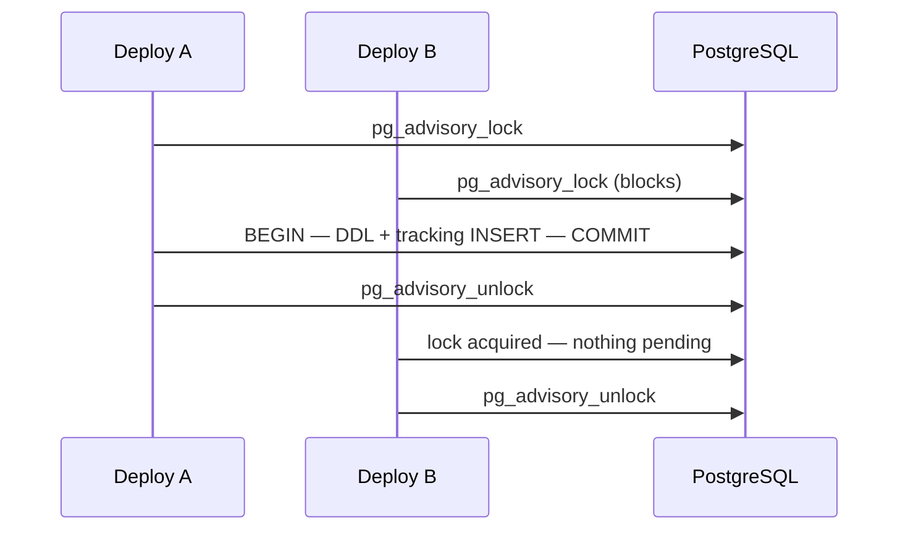

Migrations are version control for your database schema. Each migration is a small Python file that knows how to apply a change (`up`) and how to revert it (`down`). Alata tracks which migrations have run, applies pending ones in order, and can roll back the last batch — safely, even when several deploy processes race each other.

## Generating Migrations

Generate a new migration with the project CLI:

```bash
./alata make:migration create_posts_table
```

This writes a timestamped file to `database/migrations/`:

```
database/migrations/2026_07_28_143000_create_posts_table.py
```

The timestamp prefix (`YYYY_MM_DD_HHMMSS_`) keeps migrations sorted in creation order — that filename order is exactly the order they run in. The migration name is converted to a PascalCase class name, and when the name follows the `create_<table>_table` pattern, the stub pre-fills the table name:

```python title="database/migrations/2026_07_28_143000_create_posts_table.py"
from alata.db.migrator import Migration


class CreatePostsTable(Migration):
    def up(self):
        """
        Run the migrations.
        """
        with self.schema.create("posts") as blueprint:
            blueprint.increments("id")
            blueprint.timestamps()

    def down(self):
        """
        Revert the migrations.
        """
        self.schema.drop("posts")
```

## Migration Anatomy

Every migration subclasses `Migration` and implements two methods:

- **`up()`** — apply the change.
- **`down()`** — revert it. Write `down()` as the exact mirror of `up()`; rollbacks and `migrate:fresh` depend on it.

Inside both methods, `self.schema` is a fluent `Schema` builder bound to the current database engine. Schema operations compile through SQLAlchemy DDL, so the same migration runs on PostgreSQL, MySQL, or SQLite.

```python
from alata.db.migrator import Migration


class CreateUsersTable(Migration):
    def up(self):
        with self.schema.create("users") as table:
            table.increments("id")
            table.string("email").unique()
            table.string("name")
            table.text("bio").nullable()
            table.boolean("active").default(True)
            table.timestamps()
            table.soft_deletes()

    def down(self):
        self.schema.drop("users")
```

## Running Migrations

```bash
./alata migrate
```

Runs every pending migration, in filename order, as a new **batch**. The other commands in the family:

| Command | What it does |
| --- | --- |
| `./alata migrate` | Run all pending migrations |
| `./alata migrate:rollback` | Revert the last batch (calls each migration's `down()` in reverse order) |
| `./alata migrate:status` | Show every migration with its ran/pending state and batch number |
| `./alata migrate:fresh` | Drop everything (runs every `down()` in reverse, then drops the tracking table) and re-run all migrations from scratch |
| `./alata migrate:sync` | Mark all discovered migrations as run **without executing any SQL** |
| `./alata make:migration <name>` | Generate a new migration file |

<Callout type="warn">
`migrate:fresh` destroys all migrated tables and their data. It is for development and test databases only.
</Callout>

#### What `migrate:fresh` guarantees

The whole operation — teardown and re-run — happens under the migration lock, so a concurrent deploy cannot migrate into a database that is being torn down.

The order is deliberate: every `down()` runs first, in reverse, and the **tracking table is dropped last**. A `down()` that fails aborts the command with the failing migrations named, and leaves the tracking table intact — the database still matches its own migration history, so `migrate:rollback` still works and nothing is orphaned. Drop failures are never swallowed: re-running migrations over surviving tables would quietly produce a schema that doesn't match its migrations.

If a `down()` fails, fix it (or drop the objects by hand) and run `migrate:fresh` again.

<Callout type="info">
`migrate:sync` is the adoption path: if your tables already exist (created by hand or by a previous tool), run it once so the tracking table matches reality and `migrate` reports nothing to do.
</Callout>

### The tracking table

Alata records completed migrations in a namespaced table — `alata_migrations` by default — storing the migration name, its batch number, and when it ran. The namespaced default avoids colliding with any other tracking table already in the database. Override it in `config/database.py`:

```python title="config/database.py"
DB_CONFIG = {
    "strict_mode": settings.EFFECTIVE_DB_STRICT_MODE,
    "default": "postgres",
    "migration_table": "my_migrations",   # optional — defaults to "alata_migrations"
}
```

### PostgreSQL-first execution

Migrations are engineered for PostgreSQL and degrade gracefully elsewhere:

- **Advisory locking** — before running or rolling back, the migrator takes a PostgreSQL advisory lock. If two deploy processes run `migrate` at the same time, the second blocks until the first finishes, so a migration can never run twice concurrently.
- **Transactional DDL** — on PostgreSQL, each migration's DDL **and** its tracking-table insert run in a single transaction. If anything fails, both roll back together: no half-applied schema, no orphaned tracking rows. A failed migration exits non-zero and leaves the database exactly as it was.
- **MySQL / SQLite** — supported as secondary dialects. MySQL DDL auto-commits (no transactional DDL) and has no advisory lock; on failure the migrator best-effort calls the migration's `down()` to clean up. A few ALTER operations are not implemented for MySQL. Run production migrations on PostgreSQL.



## Creating Tables

`schema.create(name)` is a context manager that yields a `Blueprint`. Declare columns and constraints inside the block; the `CREATE TABLE` (plus any indexes) executes when the block exits:

```python
with self.schema.create("posts") as table:
    table.increments("id")
    table.integer("user_id")
    table.string("title", 200)
    table.text("body").nullable()
    table.string("status", 20).default("draft")
    table.index("status")
    table.foreign("user_id").references("id").on("users").on_delete("CASCADE")
    table.timestamps()
```

### Column types

| Method | Produces |
| --- | --- |
| `increments(name)` | Auto-incrementing `INTEGER` primary key |
| `big_increments(name)` | Auto-incrementing `BIGINT` primary key |
| `string(name, length=255)` | `VARCHAR(length)` |
| `text(name)` | `TEXT` |
| `boolean(name)` | `BOOLEAN` |
| `integer(name)` | `INTEGER` |
| `big_integer(name)` | `BIGINT` |
| `tiny_integer(name)` | `SMALLINT` |
| `float(name)` | `FLOAT` |
| `decimal(name, precision=8, scale=2)` | `NUMERIC(precision, scale)` |
| `enum(name, values)` | Dialect-portable enum (named `enum_<name>`) |
| `json(name)` | `JSON` (`JSONB` on PostgreSQL) |
| `date(name)` | `DATE` |
| `timestamp(name, tz=False)` | `TIMESTAMP`, with time zone when `tz=True` |
| `timestamps()` | `created_at` + `updated_at` (both `TIMESTAMPTZ`, nullable) |
| `soft_deletes()` | `deleted_at` (`TIMESTAMPTZ`, nullable) |

### Column modifiers

Each column method returns a definition you can keep chaining:

```python
table.string("slug").unique()
table.text("notes").nullable()
table.integer("points").default(0).unsigned()
table.string("code", 10).primary()
```

| Modifier | Effect |
| --- | --- |
| `.nullable()` | Allow `NULL` (columns are `NOT NULL` by default) |
| `.default(value)` | Column default — see below |
| `.primary()` | Mark as primary key |
| `.unique()` | Single-column unique constraint |
| `.unsigned()` | Adds a `CHECK (col >= 0)` constraint |
| `.after(column)` | Ordering hint (no-op on most backends) |
| `.change()` | In ALTER mode: modify this existing column instead of adding it |

### Database-level defaults

`.default(value)` writes a real `DEFAULT` clause into the DDL — not just an application-side default. Raw SQL inserts, other services, and manual `psql` sessions all get the default too. For server-side expressions, wrap the SQL in `Expression` so it is emitted verbatim instead of quoted:

```python
from alata.db.grammars import Expression

table.boolean("active").default(True)                              # DEFAULT true
table.string("status", 20).default("draft")                        # DEFAULT 'draft'
table.timestamp("created_at", tz=True).default(Expression("CURRENT_TIMESTAMP"))
```

### Timestamps and soft deletes

`timestamps()` creates `created_at` and `updated_at` as nullable `TIMESTAMP WITH TIME ZONE` columns — matching the timezone-aware timestamp columns every [model](/docs/database/models#timestamps) manages automatically. `soft_deletes()` creates the `deleted_at` column that the [`SoftDeletes` mixin](/docs/database/models#soft-deletes) expects.

### Indexes and unique constraints

```python
table.index("status")                      # idx_posts_status
table.index(["user_id", "status"])         # idx_posts_user_id_status (composite)
table.unique("slug")                       # uq_posts_slug
table.unique(["user_id", "title"])         # composite unique constraint
```

Index names follow `idx_<table>_<columns>` and unique constraints `uq_<table>_<columns>` — you'll need these names to drop them later.

### Foreign keys

```python
table.foreign("user_id").references("id").on("users")
table.foreign("team_id").references("id").on("teams").on_delete("CASCADE")
table.foreign("plan_id").references("id").on("plans").on_delete("SET NULL").on_update("CASCADE")
```

Valid actions for `on_delete` / `on_update` are `CASCADE`, `RESTRICT`, `SET NULL`, `SET DEFAULT`, and `NO ACTION`; the default for both is `RESTRICT`. Constraints are named `fk_<table>_<column>`.

## Altering Tables

`schema.table(name)` opens an existing table for modification. The same `Blueprint` fluent API applies, plus ALTER-only operations:

```python
def up(self):
    with self.schema.table("posts") as table:
        table.string("subtitle").nullable()              # ADD COLUMN
        table.string("status", 40).change()              # ALTER COLUMN type
        table.rename_column("body", "content")           # RENAME COLUMN
        table.drop_column("legacy_flag")                 # DROP COLUMN
        table.index("subtitle")                          # ADD INDEX
        table.foreign("editor_id").references("id").on("users")  # ADD FK
```

The full ALTER toolkit:

```python
table.drop_index("idx_posts_status")
table.drop_foreign("fk_posts_user_id")
table.drop_unique("uq_posts_slug")
table.rename_index("idx_old", "idx_new")
table.drop_primary()                        # defaults to <table>_pkey
table.add_primary(["id", "tenant_id"])
table.comment("status", "Editorial workflow state")   # pass None to drop the comment
```

<Callout type="info">
Operations run in a safe order automatically: index/constraint drops first, then column adds/changes/renames/drops, then new indexes and foreign keys. You don't have to sequence them by hand.
</Callout>

### Concurrent indexes

Building an index on a large PostgreSQL table takes a write lock that blocks every writer for the duration. `index_concurrently()` builds it without that lock:

```python
with self.schema.table("events") as table:
    table.index_concurrently("occurred_at")
```

It works in `create()` blocks too — the index is built once the table exists.

**How it runs.** `CREATE INDEX CONCURRENTLY` cannot run inside a transaction, and the lock it needs is one that the migration's own transaction already holds. So the migrator **defers** it: the migration's DDL and its tracking row commit first, and the index is built immediately afterwards on a separate autocommit connection. Two consequences worth knowing:

- The index appears a moment *after* the migration reports success, not atomically with it.
- If the build fails, the schema change stays committed — only the index is missing, and PostgreSQL may leave an unusable index behind. The migrator says so, names the index, and exits non-zero. Drop the leftover (`DROP INDEX IF EXISTS <name>`) and rebuild it, or add a follow-up migration.

The build waits at most 30 seconds to acquire its lock. Blocked behind a long-running transaction, it fails with a database error rather than waiting forever.

<Callout type="warn">
Calling `index_concurrently()` on a `Schema` bound to a connection with an open transaction — outside the migrator — raises `ConcurrentIndexInTransactionError` rather than deadlocking against itself. Declare concurrent indexes in a migration, or run them through an engine with no transaction open.
</Callout>

On dialects without concurrent index support (MySQL, SQLite) it compiles to a regular index and runs inline, so the index exists when the migration finishes.

## Other Schema Operations

```python
self.schema.drop("posts")                        # drop if exists
self.schema.drop_if_exists("posts")              # alias
self.schema.rename_table("posts", "articles")
self.schema.truncate("audit_logs")
self.schema.has_table("posts")                   # -> bool
self.schema.has_column("posts", "subtitle")      # -> bool
self.schema.comment("posts", "status", "Workflow state")
self.schema.table_comment("posts", "User-authored content")
```

`has_table` / `has_column` are handy for defensive migrations that must run against databases in mixed states:

```python
def up(self):
    if not self.schema.has_column("users", "timezone"):
        with self.schema.table("users") as table:
            table.string("timezone", 64).default("UTC")
```

## Programmatic Access

The migrator is registered in the [service container](/docs/architecture/container) as `"migrator"`, so scripts and tooling can drive it directly:

```python
from alata.container import container

migrator = container.make("migrator")
migrator.run()        # ./alata migrate
migrator.rollback()   # ./alata migrate:rollback
migrator.status()     # ./alata migrate:status
```
