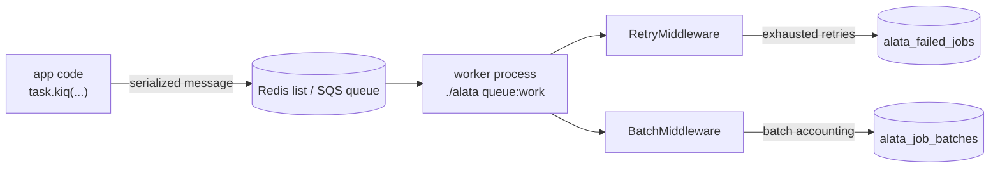

Slow work — sending email, generating reports, ingesting files — does not belong in a request handler. Alata's queue system lets you push that work onto a background queue and process it with dedicated worker processes. Underneath, the queue is powered by [taskiq](https://taskiq-python.github.io/): Alata builds and configures the broker for you, wires in retry and batch middleware, and gives you CLI tooling for workers and failed jobs.

## Architecture

The queue is wired through the same application kernel as everything else:

- `QueueProvider` registers the broker as a lazy singleton in the [service container](/docs/architecture/container) under the key `queue.broker`.
- The broker factory (`alata.queue.broker.build_broker`) reads the `queue` config namespace and builds either a Redis broker or an SQS broker, then attaches the framework's `RetryMiddleware` and `BatchMiddleware`.
- Your project's `bootstrap/broker.py` exposes the public `broker` symbol. Importing it boots the full application, so a worker that loads it gets initialized database engines and every other registered service — no worker-specific bootstrap code.

```python title="bootstrap/broker.py (scaffolded)"
from bootstrap.application import app

broker = app.make("queue.broker")
```



<Callout type="info">
Keep job payloads small — pass IDs, not objects. Workers share the application kernel, so they can fetch the heavy data from the database. Small payloads also stay safely under SQS's 256&nbsp;KB message limit.
</Callout>

## Configuration

Queue configuration lives in `config/queue.py` as the `QUEUE_CONFIG` dict, driven by your typed settings:

```python title="config/queue.py"
QUEUE_CONFIG = {
    # Active driver: 'redis' or 'sqs'.
    "default": settings.QUEUE_CONNECTION,
    # Default queue name.
    "queue": settings.QUEUE_NAME,
    # Retry settings.
    "max_retries": settings.QUEUE_MAX_RETRIES,
    "retry_delay": settings.QUEUE_RETRY_DELAY,
    # Per-driver connection settings.
    "connections": {
        "redis": {
            "broker_url": settings.REDIS_QUEUE_URL or settings.REDIS_URL,
            "result_url": settings.REDIS_QUEUE_RESULT_URL or (settings.REDIS_QUEUE_URL or settings.REDIS_URL),
        },
        "sqs": {
            "queue_name": settings.SQS_QUEUE_NAME,
            "queue_url": settings.SQS_QUEUE_URL,
            "result_bucket": settings.SQS_RESULT_BUCKET,
            "endpoint_url": settings.SQS_ENDPOINT_URL,
        },
    },
}
```

The environment variables behind it:

| Variable | Default | Purpose |
| --- | --- | --- |
| `QUEUE_CONNECTION` | `redis` | Active driver: `redis` or `sqs`. |
| `QUEUE_NAME` | `default` | Queue(s) a worker listens to. Comma-separated for priority. |
| `QUEUE_MAX_RETRIES` | `3` | Default maximum attempts per task. |
| `QUEUE_RETRY_DELAY` | `60` | Declared in config for retry delay; currently the pause between attempts is controlled per task via the `delay` label. |
| `QUEUE_RETRY_AFTER` | `3600` | Visibility timeout used by `queue:prune-orphans`. |
| `REDIS_QUEUE_URL` | falls back to `REDIS_URL` | Redis broker connection. |
| `REDIS_QUEUE_RESULT_URL` | falls back to `REDIS_QUEUE_URL` | Redis result backend connection. |

### The Redis connection

With `QUEUE_CONNECTION=redis` (the default), Alata builds a Redis list-based broker with a Redis result backend. When `QUEUE_NAME` contains commas — `high,default,low` — the worker listens on **all** listed queues with left-to-right priority: the underlying blocking pop checks `high` first, then `default`, then `low`. Dispatched jobs go to the first queue in the list unless you route them explicitly (see [Queue selection](#queue-selection)).

### The SQS connection

With `QUEUE_CONNECTION=sqs`, Alata builds an AWS SQS broker. Credentials come from your settings (`AWS_ACCESS_KEY_ID`, `AWS_SECRET_ACCESS_KEY`, `AWS_REGION` — defaulting to `us-east-1`), or from boto3's own credential chain (environment / instance profile) when none are set:

| Variable | Purpose |
| --- | --- |
| `SQS_QUEUE_NAME` | Name of the SQS queue to use. |
| `SQS_RESULT_BUCKET` | Optional S3 bucket used as the result backend — recommended for large results. |
| `SQS_ENDPOINT_URL` | Optional endpoint override for LocalStack or other local development setups. |

## Defining tasks

Tasks live in `app/tasks/` and are plain async functions decorated with `@broker.task`. Import the broker from `bootstrap/broker.py`:

```python title="app/tasks/report_tasks.py"
from bootstrap.broker import broker


@broker.task(task_name="reports:generate")
async def generate_report_task(user_id: str, report_id: int) -> None:
    # Fetch heavy data here — the worker has full database access.
    ...
```

Give every task an explicit `task_name`. The name is what gets serialized into messages, stored with failed jobs, and used to look tasks up when retrying — a stable name survives moving or renaming the function.

<Callout type="warn">
The worker discovers task modules matching `app/tasks/*_tasks.py`. A task defined in a file that doesn't end in `_tasks.py` will dispatch fine but **never execute**, because no worker imports it.
</Callout>

Retry behavior is declared as decorator keyword arguments — taskiq stores them as message *labels* that travel with every dispatch:

```python title="app/tasks/report_tasks.py"
@broker.task(
    task_name="reports:generate",
    retry_on_error=True,
    max_retries=3,
    delay=10,  # seconds between retries
)
async def generate_report_task(user_id: str, report_id: int) -> None:
    ...
```

See [Retries](#retries) for what each label does.

## Dispatching jobs

Call `.kiq()` on the task to push it onto the queue. It's awaitable, so dispatch from any async context — HTTP handlers, event listeners, other tasks:

```python title="app/services/report_service.py"
from app.tasks.report_tasks import generate_report_task

async def request_report(user_id: str, report_id: int) -> None:
    await generate_report_task.kiq(user_id, report_id)
```

`kiq()` accepts the same positional and keyword arguments as the task function. The call returns as soon as the message is on the broker.

### Queue selection

By default a job lands on the broker's primary queue. To route a specific dispatch to another queue, attach the `queue_name` label through the task's *kicker* — a per-dispatch builder:

```python
from config.queue import Queue

await generate_report_task.kicker().with_labels(queue_name=Queue.HIGH).kiq(user_id, report_id)
```

The scaffolded `config/queue.py` ships a `Queue` constants class (`Queue.HIGH`, `Queue.DEFAULT`, `Queue.LOW`) so queue names aren't magic strings. A worker only processes queues it listens to, so start workers with a matching `--queue` list.

### Labels

Labels are arbitrary key-value metadata that travel with the message. The framework uses them for retries (`retry_on_error`, `max_retries`, `delay`, `_retries`), routing (`queue_name`), and batches (`batch_id`) — and you can attach your own for middleware or observability:

```python
await generate_report_task.kicker().with_labels(tenant="acme").kiq(user_id, report_id)
```

<Callout type="info">
There is no delayed-dispatch feature on the built-in brokers: the `delay` label controls the pause **between retry attempts**, not when a job first runs. For "run this at 02:00" style work, use the [scheduler](/docs/digging-deeper/scheduling).
</Callout>

## Running workers

Start a worker with the project CLI:

```bash
./alata queue:work
```

Options:

| Option | Default | Purpose |
| --- | --- | --- |
| `--queue` | `default` | Queue(s) to listen to; comma-separated for priority (`high,default,low`). |
| `--workers` | `2` | Number of concurrent worker processes. |
| `--reload` | off | Hot-reload on code changes (development). |

```bash
# Production-ish: 4 processes draining high before default before low
./alata queue:work --queue=high,default,low --workers=4

# Development: single default queue with hot reload
./alata queue:work --reload
```

Pass `-v` (or `-vv`/`-vvv`) to raise worker log output to `DEBUG`. Under the hood the command sets `QUEUE_NAME` from `--queue` and executes the taskiq worker against `bootstrap.broker:broker` with task discovery over `app/tasks/*_tasks.py` — so a worker is just another entry point into the same application kernel.

<Callout type="info">
For a supervised worker pool with a web dashboard — job status, runtimes, batches, failures — see the [Horizon package](/docs/packages/horizon). `queue:work` starts a bare worker process directly.
</Callout>

## Retries

Failed tasks are handled by the framework's `RetryMiddleware`, attached automatically when the broker is built. Whether and how a task retries is controlled per task via labels:

- **`retry_on_error`** — opt a task into retries (`True`/`False`). Tasks that don't set it do not retry by default.
- **`max_retries`** — maximum total attempts. Defaults to `QUEUE_CONFIG["max_retries"]` (`QUEUE_MAX_RETRIES`, default 3).
- **`delay`** — seconds to sleep before re-dispatching. Without it, retries happen immediately.

A failed attempt is re-dispatched with an incremented internal `_retries` counter and the **same task id**, so a retried job is one logical job across attempts. An attempt retries while `attempts < max_retries`; once the limit is reached the failure is final.

### The `failed()` callback

When a job permanently fails — all retries exhausted — Alata invokes a *failed handler* if you've defined one, so the job can clean up or notify. Two ways to register it:

**By convention** — define a function named `<task_function>_failed` in the same module. It receives the exception followed by the task's original arguments:

```python title="app/tasks/report_tasks.py"
@broker.task(task_name="reports:generate", retry_on_error=True, max_retries=3)
async def generate_report_task(user_id: str, report_id: int) -> None:
    ...


async def generate_report_task_failed(exception: Exception, user_id: str, report_id: int) -> None:
    logger.critical(f"Report generation permanently failed for report={report_id}: {exception}")
```

**Explicitly** — with the `failed_handler` decorator:

```python
from alata.queue.retry_middleware import failed_handler

@failed_handler(generate_report_task)
async def on_generate_failed(exception: Exception, user_id: str, report_id: int) -> None:
    ...
```

Handlers may be sync or async; a handler that raises is logged and never crashes the worker. After the handler runs, the job is persisted to the failed-jobs table (below).

## Job batches

A batch dispatches a group of jobs and tracks them as one unit — with completion callbacks that fire exactly once when the whole group finishes. Build one with `Batch.create()` and the `job()` helper:

```python
from alata.queue.batch import Batch, job

from app.tasks.import_tasks import import_chunk_task, notify_task

batch = await (
    Batch.create(
        "import:customers",
        [job(import_chunk_task, chunk_id) for chunk_id in chunk_ids],
    )
    .then(job(notify_task, "Import finished"))
    .catch(job(notify_task, "Import had failures"))
    .finally_(job(notify_task, "Import ended"))
    .dispatch()
)

print(batch.record.id)  # UUID of the alata_job_batches row
```

- `Batch.create(name, jobs)` returns a `PendingBatch` builder.
- `job(task, *args, **kwargs)` wraps a task and its arguments; chain `.with_labels(queue_name="high")` on it to attach labels (routing works inside batches too).
- `.then(job(...))` — queued when the batch completes with **no** failed jobs.
- `.catch(job(...))` — queued when the batch completes with **at least one** permanently failed job.
- `.finally_(job(...))` — queued when the batch completes, regardless of outcome.
- `await .dispatch()` writes the batch record, tags every job with a `batch_id` label, kicks them all, and returns a `Batch` wrapping the database record.

Each callback method can be called multiple times to register several callback jobs. Callbacks are themselves queued jobs, dispatched by the worker that observes the batch finishing.

### How batch accounting works

Dispatching records the batch in the `alata_job_batches` table with `total_jobs` and `pending_jobs` counters. As each tagged job reaches a **final** outcome, the framework's `BatchMiddleware` atomically decrements `pending_jobs` (under a row lock, so exactly one worker observes the transition to zero — callbacks fire exactly once even when the last two jobs finish concurrently). Permanent failures increment `failed_jobs` and append the task id to `failed_job_ids`.

Batch accounting is **retry-aware**: a failed attempt that the retry middleware will re-dispatch is not a final outcome, so it neither decrements `pending_jobs` nor counts as a batch failure. Only the job's last attempt — success, or failure with retries exhausted — moves the counters. The `catch` callbacks therefore run at batch completion when any job has *permanently* failed, not on the first failed attempt.

### Pruning old batches

Batch rows accumulate; prune them periodically:

```bash
./alata queue:prune-batches                    # finished > 24h ago, unfinished > 72h ago
./alata queue:prune-batches --hours=48         # keep finished batches 48h (-H shorthand)
./alata queue:prune-batches --unfinished=168   # keep zombie unfinished batches 7 days
```

`--hours` (`-H`, default 24) controls retention for finished and cancelled batches; `--unfinished` (default 72) controls retention for batches that never finished. Schedule it from your [console kernel](/docs/digging-deeper/scheduling) to keep the table lean.

## Failed jobs

When a job exhausts its retries, the retry middleware writes a durable record to the `alata_failed_jobs` table — the full arguments, labels, and traceback — so a Redis flush or a redeploy can't erase the evidence, and the job can be re-dispatched later.

### Inspecting failures

```bash
./alata queue:failed              # last 20 failed jobs
./alata queue:failed --limit=50   # last 50
```

The table shows each job's ID, UUID, task name, queue, failure time, and a preview of the exception.

### Retrying failed jobs

```bash
./alata queue:retry 9f6c2b1e-...   # retry one job by UUID
./alata queue:retry --all          # retry every failed job
```

`queue:retry` re-dispatches the stored payload — arguments *and* labels, so metadata like a `batch_id` survives — onto the job's original queue, with the retry counter reset so the job gets a fresh set of attempts. Successfully re-dispatched jobs are removed from the failed-jobs table.

### Flushing failures

```bash
./alata queue:flush   # delete all failed job records
```

### Pruning orphaned jobs

If a worker dies mid-job (OOM kill, host failure), dashboard state can show the job as running forever. The prune command finds jobs that have been reserved longer than `QUEUE_RETRY_AFTER` (default 3600 seconds) and transitions them to failed:

```bash
./alata queue:prune-orphans
```

This command operates on the tracking data maintained by the [Horizon](/docs/packages/horizon) dashboard; without Horizon there is simply nothing to prune. The scaffolded console kernel already schedules it hourly:

```python title="app/console/kernel.py (scaffolded)"
schedule.command("queue:prune-orphans").hourly()
```

## Database tables

Two framework tables back batches and failed jobs. The scaffolded project ships migrations for both (`create_job_batches_table`, `create_failed_jobs_table`), so `./alata migrate` creates them on day one. They are exposed as regular [models](/docs/database/models) in `alata.queue.models`:

**`JobBatch`** — table `alata_job_batches`. One row per batch: `id` (UUID), `name`, `total_jobs`, `pending_jobs`, `failed_jobs`, `failed_job_ids` (JSON array), `options` (JSON — the serialized then/catch/finally callbacks), and integer UNIX timestamps `created_at`, `cancelled_at`, `finished_at`.

**`FailedJob`** — table `alata_failed_jobs`. One row per permanently failed job: `id`, `uuid` (the task id, unique), `connection`, `queue`, `task_name`, `payload` (JSON — args, kwargs, and labels), `exception` (full traceback text), `failed_at`.

Because they're ordinary models, you can query them from your own code:

```python
from alata.queue.models import FailedJob

recent = await FailedJob.where("task_name", "reports:generate").order_by("id", "desc").limit(10).aget()
```
