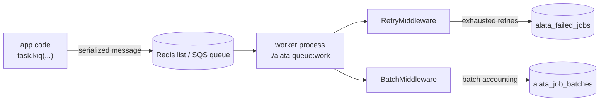

Slow work — sending email, generating reports, ingesting files — does not belong in a request handler. Alata's queue system lets you push that work onto a background queue and process it with dedicated worker processes. Underneath, the queue is powered by [taskiq](https://taskiq-python.github.io/): Alata builds and configures the broker for you, wires in retry and batch middleware, and gives you CLI tooling for workers and failed jobs.

## Architecture

The queue is wired through the same application kernel as everything else:

- `QueueProvider` registers the broker as a lazy singleton in the [service container](/docs/architecture/container) under the key `queue.broker`.
- The broker factory (`alata.queue.broker.build_broker`) reads the `queue` config namespace and builds either a Redis broker or an SQS broker, then attaches the framework's `RetryMiddleware` and `BatchMiddleware`.
- Your project's `bootstrap/broker.py` exposes the public `broker` symbol. Importing it boots the full application, so a worker that loads it gets initialized database engines and every other registered service — no worker-specific bootstrap code.
- The broker takes part in the [application lifecycle](/docs/architecture/lifecycle). On shutdown `QueueProvider` closes it — releasing the Redis connection pools it owns — and, on the in-process broker, first waits for already-accepted jobs to finish (bounded, so teardown can never hang). A broker that was never resolved is never built just to be torn down.

```python title="bootstrap/broker.py (scaffolded)"
from bootstrap.application import app

broker = app.make("queue.broker")
```



<Callout type="info">
Keep job payloads small — pass IDs, not objects. Workers share the application kernel, so they can fetch the heavy data from the database. Small payloads also stay safely under SQS's 256&nbsp;KB message limit.
</Callout>

## Configuration

Queue configuration lives in `config/queue.py` as the `QUEUE_CONFIG` dict, driven by your typed settings:

```python title="config/queue.py"
QUEUE_CONFIG = {
    # Active driver: 'redis', 'sqs', 'database', 'sync', or 'null'.
    "default": settings.QUEUE_CONNECTION,
    # Default queue name.
    "queue": settings.QUEUE_NAME,
    # Retry settings. `retry_delay` is the default backoff (seconds) applied
    # to tasks that declare no `delay` label of their own.
    "max_retries": settings.QUEUE_MAX_RETRIES,
    "retry_delay": settings.QUEUE_RETRY_DELAY,
    # Per-driver connection settings.
    "connections": {
        "redis": {
            "broker_url": settings.REDIS_QUEUE_URL or settings.REDIS_URL,
            "result_url": settings.REDIS_QUEUE_RESULT_URL or (settings.REDIS_QUEUE_URL or settings.REDIS_URL),
        },
        "sqs": {
            "queue_name": settings.SQS_QUEUE_NAME,
            "queue_url": settings.SQS_QUEUE_URL,
            "result_bucket": settings.SQS_RESULT_BUCKET,
            "endpoint_url": settings.SQS_ENDPOINT_URL,
        },
    },
}
```

The environment variables behind it:

| Variable | Default | Purpose |
| --- | --- | --- |
| `QUEUE_CONNECTION` | `redis` | Active driver: `redis`, `sqs`, `database`, `sync`, or `null`. |
| `QUEUE_NAME` | `default` | Queue(s) a worker listens to. Comma-separated for priority. |
| `QUEUE_MAX_RETRIES` | `3` | Default maximum attempts per task. |
| `QUEUE_RETRY_DELAY` | `60` | Default seconds to wait before re-dispatching a failed attempt, for tasks that declare no `delay` label. `0` retries immediately. |
| `QUEUE_RETRY_AFTER` | `3600` | Visibility timeout used by `queue:prune-orphans`. |
| `REDIS_QUEUE_URL` | falls back to `REDIS_URL` | Redis broker connection. |
| `REDIS_QUEUE_RESULT_URL` | falls back to `REDIS_QUEUE_URL` | Redis result backend connection. |

### The in-process connection

`QUEUE_CONNECTION=sync` builds an inline broker: `.kiq()` runs the task before it returns. No server, no worker, nothing to install — the right choice for tests and local development, where a job that fails should fail the caller rather than disappear into a background task.

It is a genuinely different execution model, not a lighter Redis:

- Jobs run **inside** the process that dispatched them, competing with it for the loop.
- Nothing is persisted. A restart drops everything not yet finished.
- There is **no queue to drain**, so worker processes do not apply — see [Running workers](#running-workers).

The same broker is what you get when `QUEUE_CONNECTION=redis` is selected but no broker URL is configured. That degradation is deliberate — the application still boots with no Redis server available — but it is never silent: the framework logs

```
queue running on the inline broker — jobs execute in the dispatching process; configure the database, Redis or SQS connection for real workers
```

<Callout type="warn">
Do not ship `sync` (or a URL-less `redis`) to production. Anything dispatched during a deploy, crash, or scale-down is gone, and background work runs in your web process.
</Callout>

### The database connection

`QUEUE_CONNECTION=database` turns the database your application already has into the queue. Dispatched jobs are rows in the `alata_jobs` table, `queue:work` runs real worker processes against them, and an accepted job survives a restart, a crash, or a deploy — with no broker server to install, secure, or pay for. Results land in `alata_job_results`, so `await task.wait_result()` works here too (see [Results](#results)).

It needs exactly two things:

```bash
QUEUE_CONNECTION=database
```

```bash
alata migrate   # creates alata_jobs and alata_job_results
```

Everything else has a working default. To tune the driver, add a `database` block to the `connections` dict in `config/queue.py`:

```python title="config/queue.py"
"connections": {
    "database": {
        # Table holding the jobs.
        "table": "alata_jobs",
        # Named database connection the queue lives on.
        "connection": "default",
        # Seconds an idle worker waits before polling again.
        "poll_interval": 1.0,
        # Reservation timeout — see below.
        "retry_after": settings.QUEUE_RETRY_AFTER,
        # Table holding finished jobs' results.
        "result_table": "alata_job_results",
        # Seconds a result stays readable — see below.
        "result_ttl": 86400,
    },
    # ... redis, sqs
},
```

`QUEUE_NAME` works exactly as it does on Redis: `QUEUE_NAME=high,default,low` makes the worker drain `high` before `default` before `low`, and dispatches with no explicit queue go to the first name in the list.

#### How a job is claimed

Every poll claims **one** job in a single transaction:

```sql
SELECT id, payload FROM alata_jobs
 WHERE queue = :queue
   AND (   (reserved_at IS NULL AND available_at <= :now)     -- due and waiting
        OR  reserved_at <= :now - :retry_after )              -- reservation timed out
 ORDER BY id LIMIT 1
   FOR UPDATE SKIP LOCKED;

UPDATE alata_jobs
   SET reserved_at = :now, attempts = attempts + 1
 WHERE id = :id AND (the same predicate);
```

`FOR UPDATE SKIP LOCKED` is what lets many workers share one table: a worker walks past rows another worker is mid-claim on instead of queueing behind them, and the row lock it holds until commit is what makes its own claim exclusive. Reclaiming a timed-out reservation is part of the *same* predicate rather than a separate sweep — a "find stale jobs and re-queue them" pass is precisely where two servers both decide a job is abandoned and both run it. The `UPDATE` repeats the predicate, so the row count decides the winner even where no lock is held.

PostgreSQL and MySQL 8+ / MariaDB 10.6+ support `SKIP LOCKED` and get it. SQLite runs the same statements without the locking clause — its writers are serialized, so the guarded `UPDATE` is enough — which is correct, just not concurrent. Any other dialect refuses to start rather than run a claim whose exclusivity has not been established.

#### The reservation timeout

`retry_after` (default `3600`, from `QUEUE_RETRY_AFTER`) is **how long a worker may hold a claimed job before another server is allowed to take it**. A worker that is killed mid-job leaves its reservation behind; once the timeout passes, the job is claimable again, which is what stops a dead worker from stranding work forever.

<Callout type="warn">
`retry_after` must be longer than your slowest job. A job still running when its reservation expires will be started a second time on another worker, with the first copy still going.
</Callout>

Delivery is therefore **at least once**: acknowledging a job deletes its row, so a worker that dies between claiming and acknowledging gives the job back to the pool. Write tasks so a second run is harmless.

#### `attempts` and deferral

`attempts` counts **claims**, not failures. A job that hard-kills its worker — out of memory, `SIGKILL` — never raises anything for the retry middleware to see, so a failure-counted column would leave it poisoning the queue forever; counting deliveries records the attempts nothing survived to report. It is a delivery record on one row, separate from the retry budget: [retries](#retries) still work the same way, re-dispatching through a brand-new row.

The `delay` label defers a dispatch durably — the row is written immediately with `available_at` set into the future, and no worker sees it until then, restart or not.

<Callout type="info">
`delay` is also the retry backoff label, and this connection serves that wait itself: the re-dispatched row simply carries a future `available_at`. The retry middleware detects that and skips its own in-worker sleep, so a retried job waits the backoff exactly once — and waits it in the database rather than tying up a worker process for the duration.
</Callout>

Jobs are held as text in the `payload` column, so the broker's serializer has to produce text (the default JSON one does). A serializer emitting raw binary is rejected at dispatch with a message naming the fix rather than corrupting the row.

#### Results

`await task.wait_result()` works on this connection, exactly as it does on Redis and SQS. A finished job writes one row to `alata_job_results` keyed by task id, so the process that dispatched the job can read the outcome even though another process ran it:

```python
task = await generate_report_task.kiq(user_id, report_id)
result = await task.wait_result(timeout=30)

if result.is_err:
    result.raise_for_error()
print(result.return_value)
```

`is_result_ready()` is `False` until the job has finished and `True` afterwards; a failed job stores `is_err=True` with a description of the exception, so `raise_for_error()` raises.

<Callout type="warn">
**Results always expire.** `result_ttl` (default `86400` — 24 hours) is applied to every result written; there is no "keep forever" setting. A results table that only grows is an outage with a long fuse. Raise `result_ttl` if you collect results later than a day after dispatch, and remember that a result older than the TTL reads exactly like a task that has not finished yet.
</Callout>

Expiry is enforced on both sides. Reads treat an expired row as absent, so the answer never depends on whether a cleanup has run. Writes prune: a `set_result` may also delete every expired row — one indexed `DELETE`, at most once every few minutes per process — so the sweep rides on work that is already happening instead of a background task you have to supervise.

Results are stored as a JSON document holding the return value, `is_err`, `execution_time`, `labels`, and the error. Two limits are worth knowing:

- **The return value must be JSON-compatible.** A value that will not serialize does not take the worker down: the value is dropped, an error result naming the offending type is stored instead, and a warning is logged. The caller sees a failure rather than waiting out its timeout for a result that was never written. Return ids and re-fetch, exactly as you would for a job payload.
- **Tracebacks do not survive.** An error comes back as its type, module and arguments — enough to rebuild the original exception class when it is importable, and a stand-in with the same name and message when it is not. `__cause__` and `__context__` come back too. For the line it failed on, read the worker's logs.

### The Redis connection

With `QUEUE_CONNECTION=redis` (the default), Alata builds a Redis list-based broker with a Redis result backend. When `QUEUE_NAME` contains commas — `high,default,low` — the worker listens on **all** listed queues with left-to-right priority: the underlying blocking pop checks `high` first, then `default`, then `low`. Dispatched jobs go to the first queue in the list unless you route them explicitly (see [Queue selection](#queue-selection)).

### The SQS connection

With `QUEUE_CONNECTION=sqs`, Alata builds an AWS SQS broker. Credentials come from your settings (`AWS_ACCESS_KEY_ID`, `AWS_SECRET_ACCESS_KEY`, `AWS_REGION` — defaulting to `us-east-1`), or from boto3's own credential chain (environment / instance profile) when none are set:

| Variable | Purpose |
| --- | --- |
| `SQS_QUEUE_NAME` | Name of the SQS queue to use. |
| `SQS_RESULT_BUCKET` | Optional S3 bucket used as the result backend — recommended for large results. |
| `SQS_ENDPOINT_URL` | Optional endpoint override for LocalStack or other local development setups. |

### The null connection

`QUEUE_CONNECTION=null` is the "turn queueing off" switch. `.kiq()` still succeeds and still returns a task handle, but nothing is enqueued and the task body never runs — the dispatch is accepted and dropped. It is a real broker, so `@broker.task` decorators, labels, middlewares and shutdown all behave normally; only the delivery is missing.

Two situations call for it:

- **Tests and CI runs** that exercise code paths which dispatch jobs, without triggering the side effects those jobs would cause.
- **Instances that must not produce background work** — a read-only replica, a maintenance or bulk-import process — where dropping the job is preferable to queueing one nobody is meant to run.

There is nothing to consume, so `listen()` raises and `queue:work` refuses to start against this connection.

Asking a discarded job for its result never blocks. The result is reported as ready immediately and comes back marked as an error — `is_err` is `True`, `return_value` is `None`, and `error` explains that the task was discarded — so `await task.wait_result()` returns at once and `result.raise_for_error()` raises with an actionable message instead of hanging or faking a success.

<Callout type="warn">
Jobs are dropped silently — that is the whole point of the connection, and there is no per-dispatch warning to alert you (a single informational line at startup notes that dispatches are being discarded). Selecting `null` in an environment that actually needs its jobs to run means that work disappears with no failure anywhere.
</Callout>

## Defining tasks

Tasks live in `app/tasks/` and are plain async functions decorated with `@broker.task`. Import the broker from `bootstrap/broker.py`:

```python title="app/tasks/report_tasks.py"
from bootstrap.broker import broker


@broker.task(task_name="reports:generate")
async def generate_report_task(user_id: str, report_id: int) -> None:
    # Fetch heavy data here — the worker has full database access.
    ...
```

Give every task an explicit `task_name`. The name is what gets serialized into messages, stored with failed jobs, and used to look tasks up when retrying — a stable name survives moving or renaming the function.

<Callout type="warn">
The worker discovers task modules matching `app/tasks/*_tasks.py`. A task defined in a file that doesn't end in `_tasks.py` will dispatch fine but **never execute**, because no worker imports it.
</Callout>

Retry behavior is declared as decorator keyword arguments — taskiq stores them as message *labels* that travel with every dispatch:

```python title="app/tasks/report_tasks.py"
@broker.task(
    task_name="reports:generate",
    retry_on_error=True,
    max_retries=3,
    delay=10,  # seconds between retries
)
async def generate_report_task(user_id: str, report_id: int) -> None:
    ...
```

See [Retries](#retries) for what each label does.

## Dispatching jobs

Call `.kiq()` on the task to push it onto the queue. It's awaitable, so dispatch from any async context — HTTP handlers, event listeners, other tasks:

```python title="app/services/report_service.py"
from app.tasks.report_tasks import generate_report_task

async def request_report(user_id: str, report_id: int) -> None:
    await generate_report_task.kiq(user_id, report_id)
```

`kiq()` accepts the same positional and keyword arguments as the task function. The call returns as soon as the message is on the broker.

### Queue selection

By default a job lands on the broker's primary queue. To route a specific dispatch to another queue, attach the `queue_name` label through the task's *kicker* — a per-dispatch builder:

```python
from config.queue import Queue

await generate_report_task.kicker().with_labels(queue_name=Queue.HIGH).kiq(user_id, report_id)
```

The scaffolded `config/queue.py` ships a `Queue` constants class (`Queue.HIGH`, `Queue.DEFAULT`, `Queue.LOW`) so queue names aren't magic strings. A worker only processes queues it listens to, so start workers with a matching `--queue` list.

### Labels

Labels are arbitrary key-value metadata that travel with the message. The framework uses them for retries (`retry_on_error`, `max_retries`, `delay`, `_retries`), routing (`queue_name`), and batches (`batch_id`) — and you can attach your own for middleware or observability:

```python
await generate_report_task.kicker().with_labels(tenant="acme").kiq(user_id, report_id)
```

<Callout type="info">
On `redis`, `sqs`, `sync` and `null`, the `delay` label controls the pause **between retry attempts**, not when a job first runs. The `database` connection is the exception: it stores `available_at` on the row, so a `delay` genuinely defers first delivery too. For "run this at 02:00" style work, reach for the [scheduler](/docs/digging-deeper/scheduling) rather than a long delay.
</Callout>

## Running workers

Start a worker with the project CLI:

```bash
./alata queue:work
```

### Workers need a real broker

A worker consumes messages from a queue that lives outside the process, so it requires `redis` or `sqs`. The in-process broker has no such queue — it cannot be listened to at all.

`queue:work` checks the effective connection before it spawns anything. If the queue resolves to the in-process broker, it refuses to start and exits non-zero:

```
Cannot start a worker: the queue is running on an in-process broker.
```

The message names the fix per connection: `sync` and `null` run (or drop) work in-process and want no worker; `database` needs `alata migrate` to have created its table; `redis` is missing `REDIS_QUEUE_URL` (or `REDIS_URL`); `sqs` is missing `SQS_QUEUE_NAME` and credentials. The redis→inline fallback warning is emitted here too, so the reason shows up in the terminal you ran the worker from.

Options:

| Option | Default | Purpose |
| --- | --- | --- |
| `--queue` | `default` | Queue(s) to listen to; comma-separated for priority (`high,default,low`). |
| `--workers` | `2` | Number of concurrent worker processes. |
| `--reload` | off | Hot-reload on code changes (development). |

```bash
# Production-ish: 4 processes draining high before default before low
./alata queue:work --queue=high,default,low --workers=4

# Development: single default queue with hot reload
./alata queue:work --reload
```

Pass `-v` (or `-vv`/`-vvv`) to raise worker log output to `DEBUG`. Under the hood the command sets `QUEUE_NAME` from `--queue` and executes the taskiq worker against `bootstrap.broker:broker` with task discovery over `app/tasks/*_tasks.py` — so a worker is just another entry point into the same application kernel.

<Callout type="info">
For a supervised worker pool with a web dashboard — job status, runtimes, batches, failures — see the [Horizon package](/docs/packages/horizon). `queue:work` starts a bare worker process directly.
</Callout>

## Retries

Failed tasks are handled by the framework's `RetryMiddleware`, attached automatically when the broker is built. Whether and how a task retries is controlled per task via labels:

- **`retry_on_error`** — opt a task into retries (`True`/`False`). Tasks that don't set it do not retry by default.
- **`max_retries`** — maximum total attempts. Defaults to `QUEUE_CONFIG["max_retries"]` (`QUEUE_MAX_RETRIES`, default 3).
- **`delay`** — seconds to wait before re-dispatching. Omit it to use `QUEUE_CONFIG["retry_delay"]` (`QUEUE_RETRY_DELAY`, default 60); set it to `0` to retry immediately.

A failed attempt is re-dispatched with an incremented internal `_retries` counter and the **same task id**, so a retried job is one logical job across attempts. An attempt retries while `attempts < max_retries`; once the limit is reached the failure is final.

#### Who waits out the backoff

Exactly one party waits, and which one depends on the connection:

- **The broker**, on connections that can schedule delivery — the `database` connection writes the retried job with `available_at` set into the future, so nothing can claim it until then. The retry is re-dispatched immediately with the delay attached, and **no worker is blocked** while it elapses.
- **The worker**, on connections that can only accept a job for immediate delivery — `redis`, `sqs`, and the in-process and null connections. There the middleware sleeps the backoff before re-dispatching, so the worker slot is occupied for `delay` seconds.

The effective delay is the same either way, whether it came from the task's `delay` label or from `QUEUE_RETRY_DELAY`; only the party doing the waiting differs. Sizing `QUEUE_RETRY_DELAY` generously is cheap on a deferring connection and costs worker throughput on the others — a long backoff on `redis` means workers parked doing nothing, so scale worker count with it or keep the delay short.

Two failures never retry, regardless of labels:

- **`NoResultError`** — the task is opting out of storing a result, not reporting a failure.
- an exception outside **`types_of_exceptions`**, when the retry middleware has been narrowed to specific types.

Both are treated as final outcomes everywhere, including batch accounting.

### The `failed()` callback

When a job permanently fails — all retries exhausted — Alata invokes a *failed handler* if you've defined one, so the job can clean up or notify. Two ways to register it:

**By convention** — define a function named `<task_function>_failed` in the same module. It receives the exception followed by the task's original arguments:

```python title="app/tasks/report_tasks.py"
@broker.task(task_name="reports:generate", retry_on_error=True, max_retries=3)
async def generate_report_task(user_id: str, report_id: int) -> None:
    ...


async def generate_report_task_failed(exception: Exception, user_id: str, report_id: int) -> None:
    logger.critical(f"Report generation permanently failed for report={report_id}: {exception}")
```

**Explicitly** — with the `failed_handler` decorator:

```python
from alata.queue.retry_middleware import failed_handler

@failed_handler(generate_report_task)
async def on_generate_failed(exception: Exception, user_id: str, report_id: int) -> None:
    ...
```

Handlers may be sync or async; a handler that raises is logged and never crashes the worker. After the handler runs, the job is persisted to the failed-jobs table (below).

## Job batches

A batch dispatches a group of jobs and tracks them as one unit — with completion callbacks that fire exactly once when the whole group finishes. Build one with `Batch.create()` and the `job()` helper:

```python
from alata.queue.batch import Batch, job

from app.tasks.import_tasks import import_chunk_task, notify_task

batch = await (
    Batch.create(
        "import:customers",
        [job(import_chunk_task, chunk_id) for chunk_id in chunk_ids],
    )
    .then(job(notify_task, "Import finished"))
    .catch(job(notify_task, "Import had failures"))
    .finally_(job(notify_task, "Import ended"))
    .dispatch()
)

print(batch.record.id)  # UUID of the alata_job_batches row
```

- `Batch.create(name, jobs)` returns a `PendingBatch` builder.
- `job(task, *args, **kwargs)` wraps a task and its arguments; chain `.with_labels(queue_name="high")` on it to attach labels (routing works inside batches too).
- `.then(job(...))` — queued when the batch completes with **no** failed jobs.
- `.catch(job(...))` — queued when the batch completes with **at least one** permanently failed job.
- `.finally_(job(...))` — queued when the batch completes, regardless of outcome.
- `await .dispatch()` writes the batch record, tags every job with a `batch_id` label, kicks them all, and returns a `Batch` wrapping the database record.

Each callback method can be called multiple times to register several callback jobs. Callbacks are themselves queued jobs, dispatched by the worker that observes the batch finishing.

### How batch accounting works

Dispatching records the batch in the `alata_job_batches` table with `total_jobs` and `pending_jobs` counters. As each tagged job reaches a **final** outcome, the framework's `BatchMiddleware` atomically decrements `pending_jobs` (under a row lock, so exactly one worker observes the transition to zero — callbacks fire exactly once even when the last two jobs finish concurrently). Permanent failures increment `failed_jobs` and append the task id to `failed_job_ids`.

Batch accounting is **retry-aware**: a failed attempt that the retry middleware will re-dispatch is not a final outcome, so it neither decrements `pending_jobs` nor counts as a batch failure. Only the job's last attempt — success, or failure with retries exhausted — moves the counters. The `catch` callbacks therefore run at batch completion when any job has *permanently* failed, not on the first failed attempt.

"Will be re-dispatched" is not a judgement the batch middleware makes on its own. Both middlewares read one shared decision, so every failure the retry middleware declines to re-dispatch — retries exhausted, retries disabled, `NoResultError`, an exception outside `types_of_exceptions` — counts against the batch immediately. A batch can therefore never be left waiting on an attempt that was never queued.

<Callout type="info">
Retries and batch accounting agree on the *same* configuration: `max_retries`, `retry_on_error`, and any exception-type narrowing are read from the retry middleware attached to your broker, not re-derived.
</Callout>

### Pruning old batches

Batch rows accumulate; prune them periodically:

```bash
./alata queue:prune-batches                    # finished > 24h ago, unfinished > 72h ago
./alata queue:prune-batches --hours=48         # keep finished batches 48h (-H shorthand)
./alata queue:prune-batches --unfinished=168   # keep zombie unfinished batches 7 days
```

`--hours` (`-H`, default 24) controls retention for finished and cancelled batches; `--unfinished` (default 72) controls retention for batches that never finished. Schedule it from your [console kernel](/docs/digging-deeper/scheduling) to keep the table lean.

## Failed jobs

When a job exhausts its retries, the retry middleware writes a durable record to the `alata_failed_jobs` table — the full arguments, labels, and traceback — so a Redis flush or a redeploy can't erase the evidence, and the job can be re-dispatched later.

### Inspecting failures

```bash
./alata queue:failed              # last 20 failed jobs
./alata queue:failed --limit=50   # last 50
```

The table shows each job's ID, UUID, task name, queue, failure time, and a preview of the exception.

### Retrying failed jobs

```bash
./alata queue:retry 9f6c2b1e-...   # retry one job by UUID
./alata queue:retry --all          # retry every failed job
```

`queue:retry` re-dispatches the stored payload — arguments *and* labels, so metadata like a `batch_id` survives — onto the job's original queue, with the retry counter reset so the job gets a fresh set of attempts. Successfully re-dispatched jobs are removed from the failed-jobs table.

### Flushing failures

```bash
./alata queue:flush   # delete all failed job records
```

### Pruning orphaned jobs

If a worker dies mid-job (OOM kill, host failure), dashboard state can show the job as running forever. The prune command finds jobs that have been reserved longer than `QUEUE_RETRY_AFTER` (default 3600 seconds) and transitions them to failed:

```bash
./alata queue:prune-orphans
```

This command operates on the tracking data maintained by the [Horizon](/docs/packages/horizon) dashboard; without Horizon there is simply nothing to prune. The scaffolded console kernel already schedules it hourly:

```python title="app/console/kernel.py (scaffolded)"
schedule.command("queue:prune-orphans").hourly()
```

## Database tables

The `database` connection stores queued work in `alata_jobs` and finished outcomes in `alata_job_results` (shipped as the `create_jobs_table` and `create_job_results_table` migrations). The tables below back batching and failure tracking on every connection.

Two framework tables back batches and failed jobs. The scaffolded project ships migrations for both (`create_job_batches_table`, `create_failed_jobs_table`), so `./alata migrate` creates them on day one. They are exposed as regular [models](/docs/database/models) in `alata.queue.models`:

**`JobBatch`** — table `alata_job_batches`. One row per batch: `id` (UUID), `name`, `total_jobs`, `pending_jobs`, `failed_jobs`, `failed_job_ids` (JSON array), `options` (JSON — the serialized then/catch/finally callbacks), and integer UNIX timestamps `created_at`, `cancelled_at`, `finished_at`.

**`FailedJob`** — table `alata_failed_jobs`. One row per permanently failed job: `id`, `uuid` (the task id, unique), `connection`, `queue`, `task_name`, `payload` (JSON — args, kwargs, and labels), `exception` (full traceback text), `failed_at`.

Because they're ordinary models, you can query them from your own code:

```python
from alata.queue.models import FailedJob

recent = await FailedJob.where("task_name", "reports:generate").order_by("id", "desc").limit(10).aget()
```
